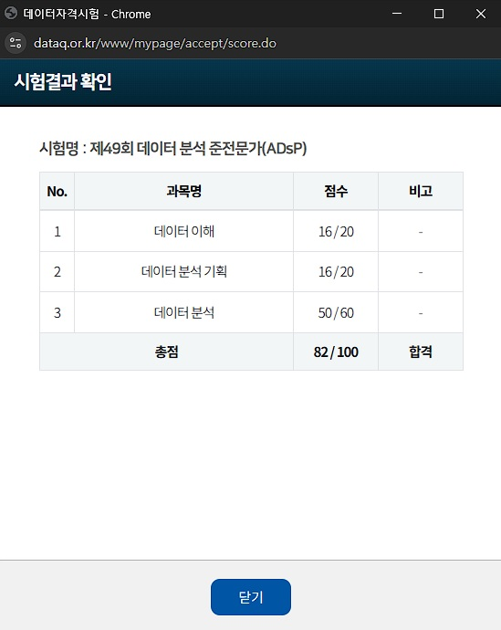

# ADsP 49회 시험 후기

그저 합격(60점)이 아닌 100점을 목표로 하여 공부했고, 시험이 시작되었다.

---

## 체감

50문제를 다 풀고 나니 40분정도가 남았다.

모르는 문제는 4~5문제 정도 되었고, 나머지를 검토하기에도 충분한 시간이었다.

### 1과목

시험장에서 체감상 가장 어려웠던 건 1과목이었다.

이해가 부족해서일 수도 있을 것이고,

문제 표현의 해석 방향에 따라 판단이 갈릴 수 있는 문항들이 있었다.

### 3과목

대체로 예상문제를 공부하며 한번쯤은 만났던 문제들이었고,

일부 문제는

> “이 상황에서 왜 이 기법을 사용하는가?”

를 생각해보지 않았다면 풀지 못했을 듯한 문제도 있었다.

---

## 결과

---

## 후기

### 과목

3과목에서 5문제를 틀렸을 줄은 몰랐다.

어느 부분이 부족했던 건지 다시 확인해보고 싶지만,

ADsP는 기출문제가 공개되지 않아 복기하기 어려운 점이 아쉽다.

### 수확

시험도 시험으로 마무리하고, 자격증이나 점수 자체보다는:

> “데이터 분석이라는 분야가 어떻게 돌아가는지”

감을 잡을 수 있었던 것이 가장 큰 수확이었다.

사실 처음에는 거창한 계획을 가지고 시작했던 시험은 아니었는데,

어느 순간부터 데이터 분석에 흥미가 생겼고, GitHub에도 무언가 꾸준히 기록하게 되었다.

돌이켜보면 그 시작에는 ADsP가 있었다.
