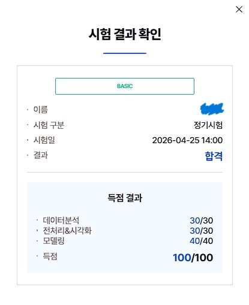

# AICE Basic 자격증 취득 후기

## 계기

초등학교 AI 강사로 활동하는 경험을 쌓기 위해  
AICE Future(이하 AF) 3급 자격이 필요하다는 것을 계기로 시험을 준비하게 되었다.

이전부터 빅데이터와 딥러닝 같은 기술에 대해 막연한 관심은 가지고 있었지만,  
구체적으로 학습해본 경험은 없는 상태였다.

## 과정

처음에는 업무 수행을 위한 최소 요건 충족이 목적이었는데,  
준비 과정에서 AI 개념과 함께 데이터에 대한 흥미가 생기면서  
자연스럽게 학습 범위를 확장하게 되었다.

그 결과 AF 3급뿐만 아니라 1급까지 동시 취득하였고,  
추가적으로 AICE Basic 과정까지 학습하며 기초 개념을 더 넓게 정리하였다.

## 결과

## 후기

같은 데이터라도 접근 방식에 따라 해석이 달라질 수 있다는 점이 흥미로웠고,  
이 경험이 데이터 분석 분야에 대한 관심으로 이어지게 되었다.
